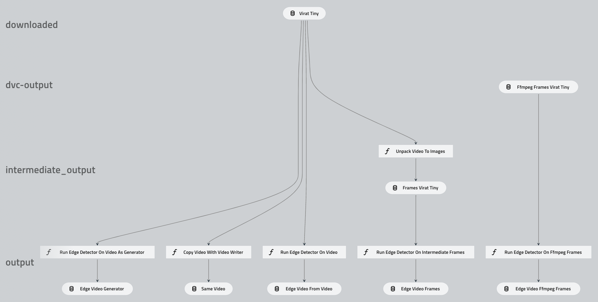

# Kedro video dataset example pipeline

This repository aims to show how the new `VideoDataSet` can be used in the Kedro project (take a look at the [Kedro documentation](https://kedro.readthedocs.io)).

The video dataset was merged in [this PR](https://github.com/kedro-org/kedro/pull/1312) and is still not included in the latest release. Make sure that you have Kedro installed from the main branch:
```
pip install --force-reinstall git+https://github.com/kedro-org/kedro
```

DVC pipelines are used to download a video file which the Kedro pipeline can run on. The DVC pipeline also uses FFMPEG to extract frames from a video, this is not needed since the Kedro `VideoDataSet` can do the same thing, but is used here as an example on how images can be used as input to the Kedro `VideoDataSet`.

There is a pipeline implemented in `src/video_example/pipelines/data_preprocessing` that reads a video using the `VideoDataSet` and saves each frame using the `PartitionedDataset` for `ImageDataSet`. There are multiple parts of the pipeline that shows how to read from images and write to video, read from video and write to images, read from video, apply a transformation to the frames and write to another video. The full pipeline is visualized in the image:


## Installation

Install the project. This will install dependencies such as Kedro and DVC. Installation can preferably be done inside a python virtual envrionment.
```bash
python -mvenv venv
source venv/bin/activate
pip install -r src/requirements.txt
```

After the installation finishes, standing in the repo root, download and reproduce the input data using dvc (which is installed from the requirements file above). This step requires the ffmpeg command which can be installed using `apt install ffmpeg` on ubuntu/debian or `brew install ffmpeg` on macOS.
```bash
dvc repro
```

This command will download an example movie, cut it to the correct length and extract the frames from it. The data is found in `data/01_raw`.

## Running

The kedro pipeline can be run with
```bash
kedro run
```
which will read the video file and create output frames in `data/02_intermediate/virat_tiny/`.

Since the `dvc repro` command also generated raw frames using ffmpeg we can now compare the output of our pipeline using the `VideoDataSet` reader to the ones generated using ffmpeg. This can be done using the Jupyter Notebook implemented in `notebooks/check_decoder_indexing.ipynb`. Start the Jupyter server with the following command and open the notebook. If the `catalog` is not defined, change the kernel to `Kedro (video_example)`
```bash
kedro jupyter notebook
```

In the notebook result it can be seen that there are some small differences in the pixel values as decoded by OpenCV (`VideoDataSet`) and ffmpeg, but there is no offset or index errors in the addressing since the diagonal of the distance comparizon is the smallest.

The kedro pipeline should also have created two edge detection videos in the `03_primary` folder. These can be played with a regular movie player, e.g. `ffplay data/03_primary/edge.mp4`.

## Running with AWS S3 storage
Update the file `conf/s3/parameters.yml` with your S3 bucket name and a prefix to use.

After running `dvc repro` to download the video and extract the frames, upload the data from `data/01_raw/virat_tiny/` to S3 in the bucket and prefix you specifies as `s3://{bucket}/{prefix}/01_raw/virat_tiny/`.

Then rerun the pipeline with `kedro run --env s3`. This command will respect the normal enviroment variables used for credentials and configuration by the aws cli and the boto3 library.
